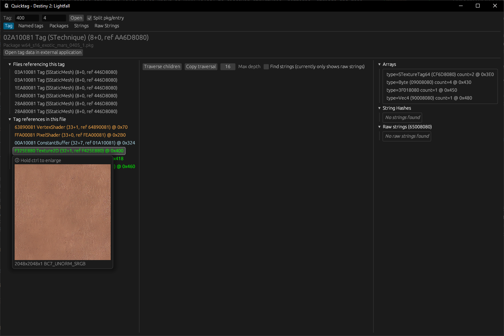

# QuickTag

QuickTag is a tool that scans and analyzes Tiger engine structure files (also known as 8080 files) to discover
structures, patterns, strings and more.

## How does QuickTag work?

When first starting QuickTag (or after a game update), QuickTag goes through every package file and scans the data for
file references, string hashes and raw strings. <!-- TODO(cohae): Document these -->
It does this by checking file references and string hashes against a set of valid values, which is generated from the
information [destiny-pkg](https://github.com/v4nguard/destiny-pkg) provides. It then stores the scanned information to a
cache file so the next time QuickTag is started, it doesn't have to scan every package file again.

### Tag Viewer



#### References (left panel)

*(TODO)*

#### Tag Traversal (central panel)

*(TODO)*

Upwards traversal is not supported yet.

#### Type analysis (right panel)

*(TODO)*

### Named Tags

*(TODO)*

### Packages

*(TODO)*

### (Localized) Strings

The strings tab shows any localized strings found in package files. These strings are referenced by a 32-bit FNV hash (
note that this is not the hash of the string itself, but rather the hash of a localization key). Due to this, there will
be multiple strings with the same hash, but different text. QuickTag will collapse these into a single entry, showing
any strings that use this hash, as well as the tags that reference them.

> [!IMPORTANT]  
> Note that due to the nature of FNV hashes, there will be a lot of false positives and overlapping strings in some
> cases.

These strings only include the English version of the string. Other languages can be dumped through Quicktag, but they
can't be used for the built-in search.

### Raw Strings

Like the strings tab, the raw strings tab shows any strings that are found with the raw string table tag (0x80800065).
These strings are usually used for debugging purposes, and can't be found in-game. Unlike localized strings, which are
referenced by a hash, raw strings are referenced by other data in the file that the string is in.

QuickTag will remove duplicates and collapse them into a single entry. Just like the strings view, selecting a string
will show the tags that reference it.

### Asset preview

QuickTag can also preview certain files, such as:

- Textures (D1 (PS4 only) and D2)
- WWise audio streams (D1+D2)

## Running

Either download the [latest release](https://github.com/v4nguard/quicktag/releases)
or [build QuickTag yourself](#building).

QuickTag can then be run with the following command:

```sh
quicktag.exe -v <version> <path to packages directory>
```

Where `<version>` is the version of the game used by the given packages. These correspond to the ones used
by `destiny-pkg`:

- `d1_devalpha` Destiny 2013 Internal Alpha
- `d1_ttk` "Legacy" version of Destiny (The Taken King)
- `d1_roi` The latest version of Destiny (Rise of Iron)
- `d2_beta` Destiny 2 Beta
- `d2_sk` The last version of Destiny before Beyond Light (Shadowkeep/Season of Arrivals)
- `d2_bl` Destiny 2 (Beyond Light/Season of the Lost)
- `d2_wq` Destiny 2 (Witch Queen/Season of the Seraph)
- `d2_lf` Destiny 2 (Lightfall)
- `d2_tfs` Destiny 2 (The Final Shape)

> [!WARNING]  
> `d1_ttk` and `d1_devalpha` support is WIP

## Building

Alkahest needs Rust 1.70 or newer to build. You can install Rust from [rustup.rs](https://rustup.rs/).

QuickTag can then be built as follows:

```sh
git clone https://github.com/v4nguard/quicktag
cd quicktag
cargo build --release
```

The resulting binary will be located at `target/release/quicktag.exe`.
> [!IMPORTANT]  
> For performance reasons, it is recommended to only build QuickTag in release mode.